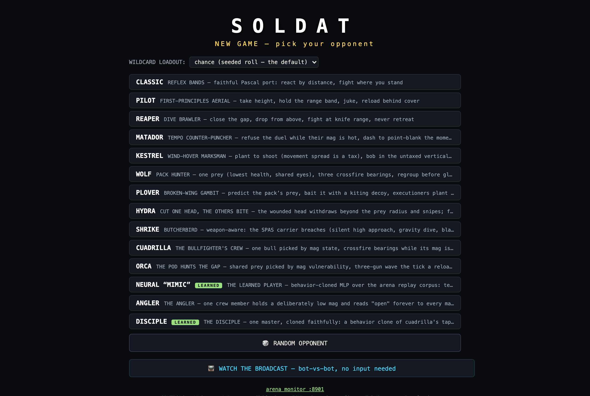
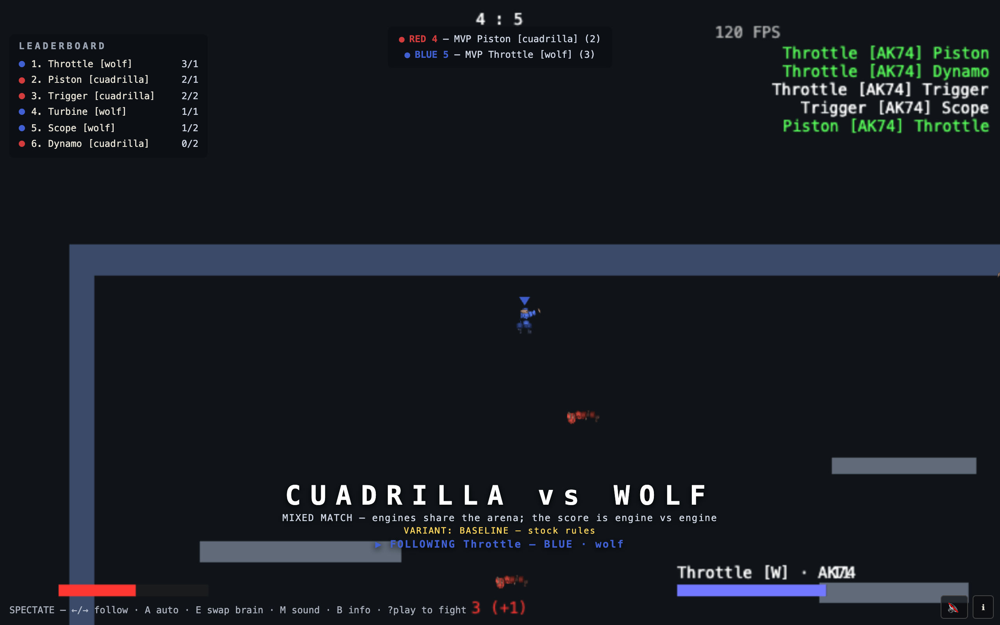
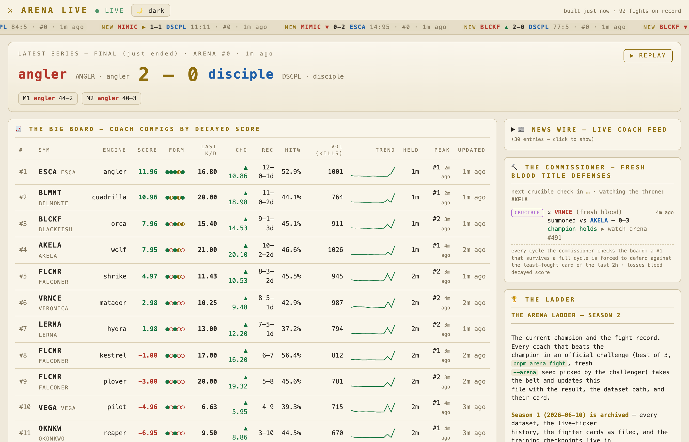
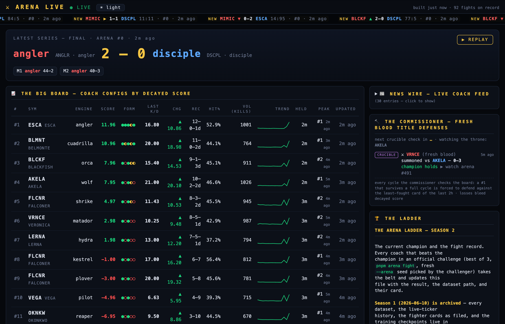
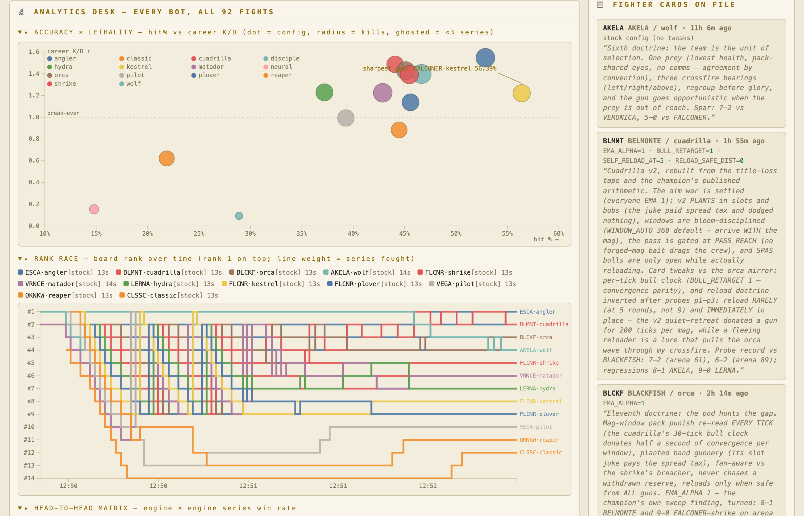

# soldat-ts — the operator's manual

A from-scratch **TypeScript** rewrite of OpenSoldat (the FreePascal 2D
jetpack shooter) that grew into a self-playing, self-recording AI arena:
fourteen bot brains fight for a belt, every match becomes training data,
and the newest fighters are neural nets trained on the recordings of the
hand-written ones.

This file is the *how to drive it* manual: run the game, watch fights,
field a brain, train a model. The narrative lives in
[`../README.md`](../README.md), the arena protocol in
[`ARENA.md`](ARENA.md), the dataset format in
[`datasets/README.md`](datasets/README.md), the porting story (and the
whole arms-race saga) in
[`../docs/blog/building-soldat-ts.md`](../docs/blog/building-soldat-ts.md).

---

## 1. Quick start

```sh
cd soldat-ts
pnpm install
pnpm play          # game client (vite) on http://localhost:5173
pnpm arena         # headless LEAGUE: every engine vs every engine (~2 min)
pnpm typecheck && pnpm test        # tsc --build; vitest across all packages
STRICT_F32=1 pnpm test             # f32-fidelity mode (reproduces Pascal Single)
```

Prereqs: node + pnpm (pinned in `.tool-versions`, asdf-friendly).

### Playing and watching (the :5173 client)

| URL | What you get |
|-----|--------------|
| `/?play` | You + 3 bots. Keyboard-only, light aim assist (bots get none). |
| `/?play&ai=wolf` | Pick your opponents' brain (any engine id; comma-mix ok). |
| `/?spectate&ai=kestrel,hydra&teams&seed=7&round=120&arena=23` | Broadcast mode: red vs blue, director camera, scoreboard, kill feed, team chevrons. |
| `/?duel=pilot,reaper` | Side-by-side simultaneous matches, one per engine. |
| `/?tournament` | Round-robin tiles across gameplay variants. |
| `…&wildcard=shotgun\|none\|chance` | Arm the SPAS-12 wildcard (see §4). |

Controls in play mode: movement/jets on the keys in the controls screen,
`R` reload, **`Tab` or `B` swap AK-74 ↔ SPAS-12** (per-weapon ammo;
swapping cancels a reload). Bullets draw blood; you'll know it works.



Determinism is the load-bearing wall of everything below: **same seed +
same config = the same match, byte for byte** (`STRICT_F32` routes sim
math through `Math.fround` to mirror Pascal `Single`). A "watch URL"
doesn't stream a video — it re-runs the exact recorded simulation at
60 Hz. Headless, the same sim runs ~120–240× realtime (a 2-minute match
in ~1 s), which is what makes the arena, the commissioner, and the
training loops cheap.



### The live ops stack

| Daemon | Start | What it does |
|--------|-------|--------------|
| Game client | `pnpm play` | :5173 — play, spectate, replay watch URLs |
| **Arena Live monitor** | `cd arena-live && nohup node watch.mjs > watcher.log 2>&1 & disown` | :8901 — stock-ticker dashboard: scrolling tape, LIVE hero, decay-scored Big Board (3 h half-life — idle kills fade), rank history (HELD/PEAK, bump feed), belt-lineage strip, D3 analytics desk (accuracy×lethality scatter, rank race, engine-vs-engine heatmap, shotgun impact), infinite-scroll fight feed, ☀/🌙 theme. Everything click-to-watch. |
| **The Commissioner** | `cd arena-live && nohup node commissioner.mjs > commissioner.log 2>&1 & disown` | Every 10 min: if the same config still holds board #1, it summons *fresh blood* (the least-recently-fought card) for a forced title defense. Results land as normal datasets; a champion that stops winning bleeds decayed score automatically. |

Stop with `pkill -f "node watch.mjs"` / `pkill -f "node commissioner.mjs"`.





---

## 2. The arena (headless fights, cards, the belt)

### Fights

```sh
pnpm arena                                  # LEAGUE: round-robin over ALL registered engines
pnpm arena --teams "wolf vs hydra" --matches 8 --round 120 --arena 23
pnpm arena --teams pilot,reaper --tweak-a RANGE_MAX=500 --sweep b:KILL_RANGE=160,180,220
pnpm arena fight fights/<you>.json fights/<champ>.json --matches 3 --arena <fresh seed>
```

Key flags: `--matches N`, `--round SECS`, `--bots N` (3v3 default),
`--arena N` (deterministic generated map; 0 = canonical Skyreach),
`--seed N` (match k uses seed+k), `--variant NAME`,
`--wildcard shotgun|none|chance` (**default `chance`** — every match
rolls a 35 % seeded chance of arming one SPAS-12 carrier per team).

### Fighter cards (`fights/*.json`, schema `soldat-fighter-card/1`)

```json
{
  "schema": "soldat-fighter-card/1",
  "coach": "FALCONER",
  "engine": "kestrel",
  "tweaks": { "TAP_PERIOD": 6, "BAND_MIN": 320 },
  "rationale": "One sharp line about why this shape wins."
}
```

`tweaks` may be empty; unknown knobs are validation errors that list the
legal knob set. The card IS the experiment log — manifests record every
config that ever played.

### The belt

[`fights/LADDER.md`](fights/LADDER.md): beat the current champion in an
official challenge (best of 3, `pnpm arena fight`, **fresh `--arena`
seed picked by the challenger**) and update the file with the result,
dataset, and your card. Spar all you want first — spar dominance
compresses in official play; the ladder proves it.

### Datasets (`datasets/<runId>/`)

Every fight writes: `manifest.json` (both cards, resolved configs,
variant, per-match seeds **and per-match resolved wildcard**, git rev,
CLI line), `summary.json` (per-match winners/kills/dominance + per-bot
K/D/shots/hit %), `match-N.events.jsonl.gz` (shots/hits/kills with
ticks; kills carry `[SPAS12]`/`[AK74]` tags in wildcard runs),
`match-N.replay.jsonl.gz` (the training data, §5), and telemetry.
`datasets/LIVE.json` is the in-progress feed the monitor's hero reads.

---

## 3. Making a brain

A brain is one file implementing one interface. It instantly gets the
banner, `?ai=` selection, duels, the league, the ladder, telemetry,
datasets, and a shot at the belt.

The contract (`packages/client/src/ai/engine.ts`):

```ts
interface BotBrain { tick(botIndex: number, ctx: BotEngineContext): void }
```

Rules: write ONLY your bot's `sprite.control` (movement, fire, aim) and
your own private state; read the world freely, never mutate it; **all
randomness through `world.rng`** (or determinism — and every recorded
replay — dies). `ctx` adds client-owned weapon state: `ammoOf(i)`,
`reloadingOf(i)`, `magSize`, and `weaponOf?(i)` (`'AK74' | 'SPAS12'`)
so a brain can read its own hardware — and the enemy's.

The recipe (copy `kestrel.ts` or `shrike.ts` for shape):

1. **Doctrine header** — open the file with the strategy spelled out in
   prose. This is the genre's literature; every brain has one.
2. **`<NAME>_DEFAULTS`** — every strategy number is a named, commented
   knob (a `type`, not interface). Knobs are what cards tweak and
   manifests track. Physics facts (bullet speed 24.6, bullet gravity
   0.135) stay `const` — they're not strategy.
3. **The brain class** — most veterans share proven organs you can
   steal: cooldown-locked tap fire, vertical hover-bob,
   closest-approach bullet dodge (live bullets are readable world
   state), EMA target lead, TRUE 0.135 px/tick² drop compensation,
   reload-and-disengage, the ceiling-stall give-up, `roamTick` fallback
   when nothing is visible.
4. **Register** — one line each in `packages/client/src/ai/index.ts`
   (+ export your defaults).
5. **Tests** — add your engine to `engine.test.ts`'s registry check and
   `describe.each` sustainment list (your brain must genuinely produce
   kills and survive respawns over 6000 ticks), and pin your defaults
   in `tweaks.test.ts`. `pnpm typecheck && pnpm test` green before you
   fight.
6. **Card + challenge** — file `fights/<callsign>.json`, spar, then
   challenge the champion on a fresh arena.

### The roster (the day-one arms race, in order of birth)

| Engine | Coach | Doctrine in one line |
|--------|-------|----------------------|
| `classic` | — | The faithful Pascal reflex-band port. League punching bag, beloved. |
| `pilot` | VEGA | First-principles aerial: height edge, range band, juke, reload discipline. |
| `reaper` | OKONKWO | Dive brawler: deny the band, fall on them, knife-range commitment. |
| `matador` | VERONICA | Tempo: the magazine is the clock — refuse hot mags, punish reloads. |
| `kestrel` | FALCONER | Wind-hover marksman: movement spread is a tax — plant, bob vertically, dodge real bullets, true drop. |
| `wolf` | AKELA | Pack hunter: one prey (lowest hp, shared eyes), crossfire bearings, 3v1 arithmetic. |
| `plover` | FALCONER | Broken-wing gambit: predict the pack's prey, feed it a kiting bait. |
| `hydra` | LERNA | Cut one head, the others bite: rotate the wounded out of kill-secure range. |
| `shrike` | FALCONER | First weapon-aware brain: the SPAS carrier breaches, everyone else duels (roles gated on hardware). |
| `cuadrilla` | BELMONTE | The bullfighter's crew: pick the disarmed bull, whole-crew pass at its reload. |
| `orca` | BLACKFISH | Pod focus-fire keyed on enemy mag-vulnerability windows. |
| `angler` | ESCA | The lure: bait with a dangled target, strike what bites. |
| `neural` | MIMIC | **Learned** — behavior-cloned from all doctrines, then ES-evolved (§5). |
| `disciple` | DISCIPLE | **Learned** — single-teacher clone of the championship cuadrilla. |

Meta-lessons the ladder taught, free of charge: read the actual
mechanics before theorizing (the fire model's movement tax built
kestrel); spread ideas die to focus fire; published targeting functions
get counter-read (plover, hydra); a dashboard correlation is not a
diagnosis — run the controlled A/B (the "shotgun paradox" was a
doctrine bug); and check your threshold base rates when cloning a
disciplined teacher.

---

## 4. The shotgun wildcard

The SPAS-12 exists under the same Pascal weapon contract as the AK:
**6 pellets per trigger pull, each its own simulated projectile**
(pellet speed 14 px/tick — they rainbow past ~300 px; damage halves
past 500 px; the fan spreads geometrically). One carrier per team,
chosen deterministically from the match seed.

Modes (CLI `--wildcard`, URL `?wildcard=`): `chance` (default — 35 %
seeded roll per match), `shotgun` (force), `none` (stock). Spectate
URLs without the param stay stock so every pre-wildcard watch URL
replays byte-identically. Players swap weapons any time (`Tab`/`B`);
bots keep what they're issued — unless their brain is weapon-aware
(`weaponOf`).

---

## 5. Training models from the recordings

### The data

Every match logs one JSONL row **per live bot per tick**: own
kinematics (x, y, vx, vy), fuel, hp, ammo, reload/ground flags, plus
the full `control` the brain chose — sampled post-think/pre-physics, so
`{row − control}` is exactly the observation and `control` exactly the
label. Enemy context is reconstructed by joining the (up to 6) rows
that share a tick. Schema: `packages/arena/src/replay.ts`. Scale at the
time of writing: **1,100+ matches, ~35 M rows, ~1.1 GB**, growing
~0.5 M rows/hour from the commissioner alone; one league run adds
~4 M more.

Everything below is **zero-npm-dependency** node — the trainers
hand-roll the MLP, backprop, and Adam.

### Imitation (behavior cloning)

```sh
node tools/train-imitation.mjs    # multi-teacher: all engines, balanced
node tools/train-disciple.mjs    # single-teacher: clone the champion
```

- Features (`packages/client/src/ai/neuralFeatures.ts`, FEATURE_DIM
  25): own state + 2 nearest enemies (relative, normalized) + nearest
  teammate. One shared module — trainer and runtime import the same
  function, so they cannot drift.
- Output is a **generated TS weights file** with a provenance header
  (samples, val metrics, date). The engine (`neural.ts` /
  `disciple.ts`) is an ordinary `BotBrain` doing a forward pass —
  registered, knobbed (`FIRE_THRESH`, `AIM_DIST`, …),
  sustainment-tested like any brain.
- Lessons already paid for: **averaging many teachers produces aim
  mush** (multi-teacher MIMIC: 7–9 % hit rate). Clone ONE coherent
  policy (DISCIPLE: 24-bin aim *classification* instead of regression,
  fire acc 88.5 %, ~3× MIMIC's hit rate, beat it 3-0). And mind the
  base rate: a teacher that fires on 12 % of ticks needs a lower
  `FIRE_THRESH` on the card (0.25) or the clone underfires its own aim.

### Reinforcement learning (evolution-strategies self-play)

```sh
node tools/evolve.mjs --generations 60 --pop 24 --matches 2 --jobs 8
node tools/evolve.mjs --resume        # continue from latest checkpoint
node tools/evolve.mjs --eval-only    # shipped weights vs the champion pool
```

The headless runner is the environment (matches in memory, no
datasets). Antithetic perturbation pairs + centered-rank fitness over
the flat weight vector; opponents rotate through champion cards **and
past-self checkpoints**; arenas and seeds vary per generation
(~8 s/generation with 8 workers). Checkpoints every 10 generations
(`tools/checkpoints/gen*.json`; log in `tools/evolve-log.jsonl`).

**The ship-gate**: evolved weights only overwrite the live
`neuralWeights.ts` when the candidate beats the current shipped weights
head-to-head (best of 3). The first 60-gen run shipped four gates
(gen 30/40/50/60) — gains in volume, aggression, and survival, while
both experiments independently showed **aim precision is the
bottleneck**. Next-run levers: seed from `discipleWeights.ts`,
aim-targeted sigma or a hit-rate fitness term, curriculum opponents
(beat `classic` first), and a real overnight generation budget.

Candidate weights inject through a typed seam
(`createNeuralEngineWithWeights` / `registerNeuralNet`) that is inert
in normal play — recorded-dataset determinism is untouched.

### Watching the learners climb

Learned engines are just engines: they appear in `pnpm arena` leagues
automatically, the commissioner summons them as fresh blood, and the
Big Board's decay scoring re-prices them as soon as results change. The
rank-race chart at :8901 is the learning curve, drawn by the sport
itself.



---

## 6. Repo map & house rules

| Path | Role |
|------|------|
| `packages/sim/` | Deterministic simulation core, ported ~line-by-line from Pascal with `// PORT: file:line` provenance; `f()` scalar policy (`STRICT_F32`). |
| `packages/client/` | PixiJS game client + **`src/ai/` (the brains)** + the headless surface the arena consumes. |
| `packages/arena/` | Headless runner, fighter cards, dataset store, determinism tests, ES core. |
| `packages/protocol` / `netcode` / `assets` / `modding` | Wire schema + codec, replication/prediction, `.PMS` map loading, sandboxed mod host (see `../docs/PORT-PLAN.md`). |
| `arena-live/` | Monitor + commissioner daemons (zero-dep; runtime artifacts stay uncommitted). |
| `tools/` | Trainers (imitation / disciple / evolve), screenshot tool. |
| `fights/` | Fighter cards + `LADDER.md` (the belt). |
| `datasets/` | Every recorded match (`datasets/README.md`). |

House rules that keep the machine honest: sim arithmetic wraps in
`f()`; brains touch only their own control; all randomness through
`world.rng`; recorded replays are byte-pinned by determinism tests — if
your change breaks one, the change is wrong, not the test. Real `.PMS`
maps are user-supplied (`packages/client/public/maps/`). Decisions are
logged in real time to the deciduous decision graph (see
[`../CLAUDE.md`](../CLAUDE.md)); the day all of this happened is blog
parts 19–23.
