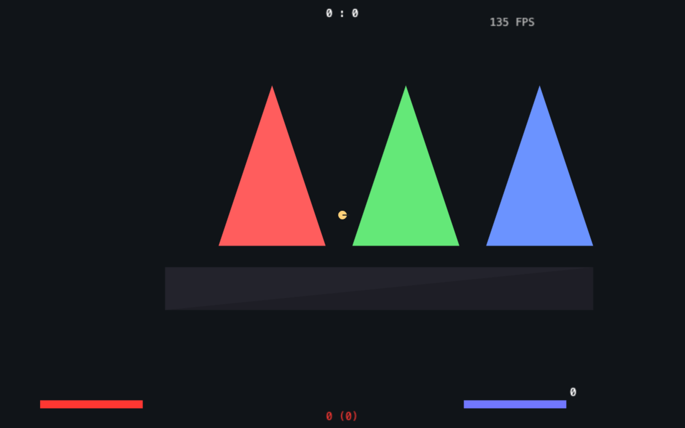
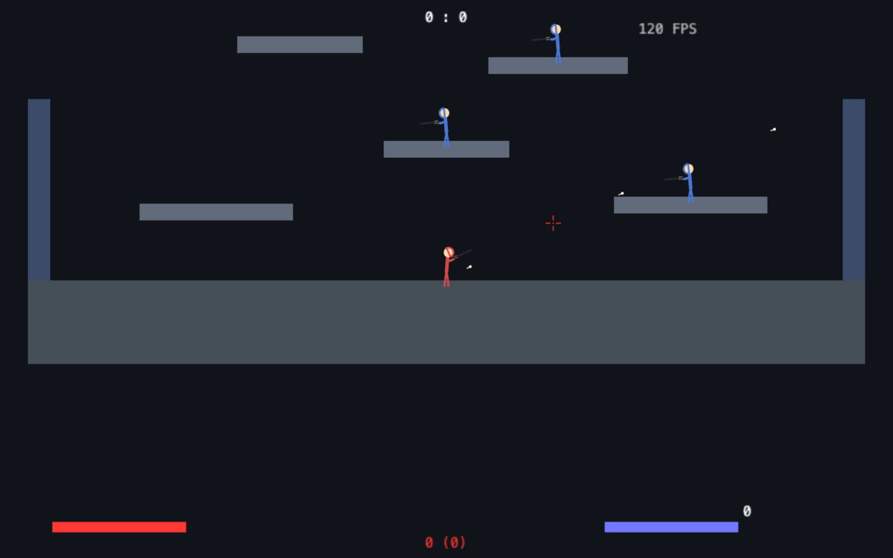
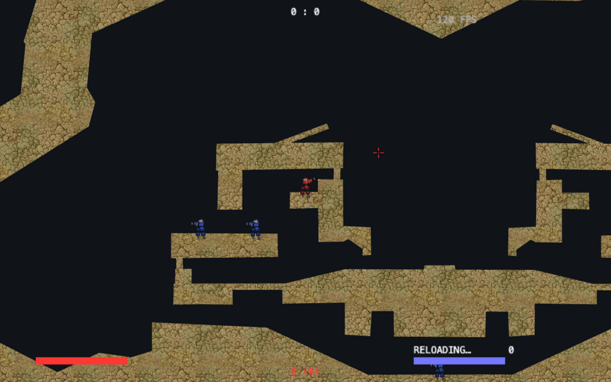
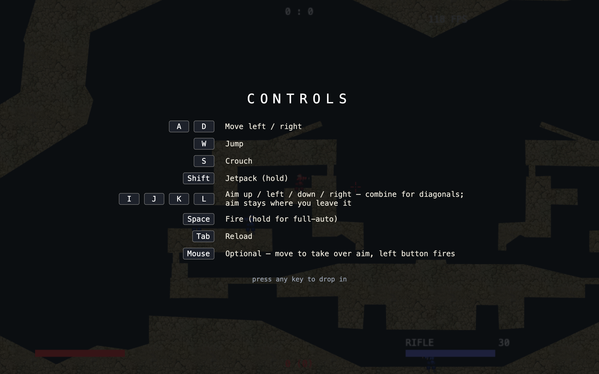
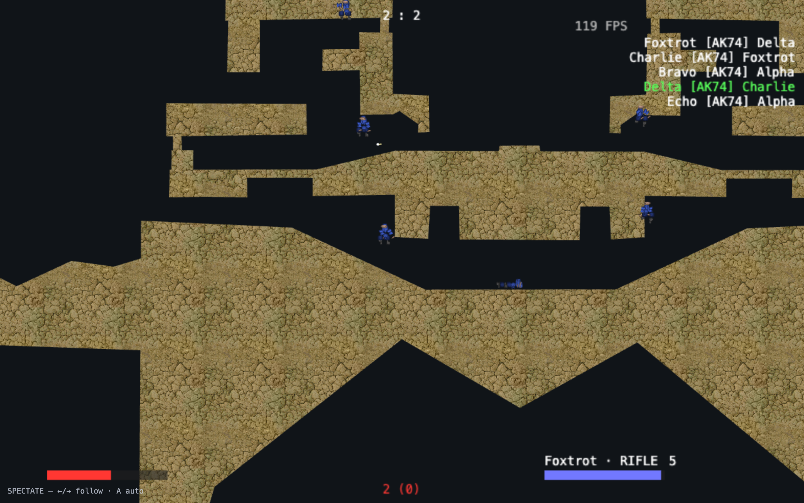
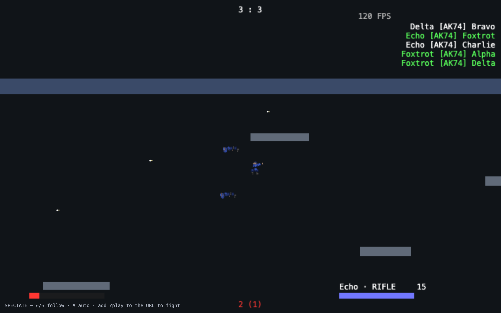
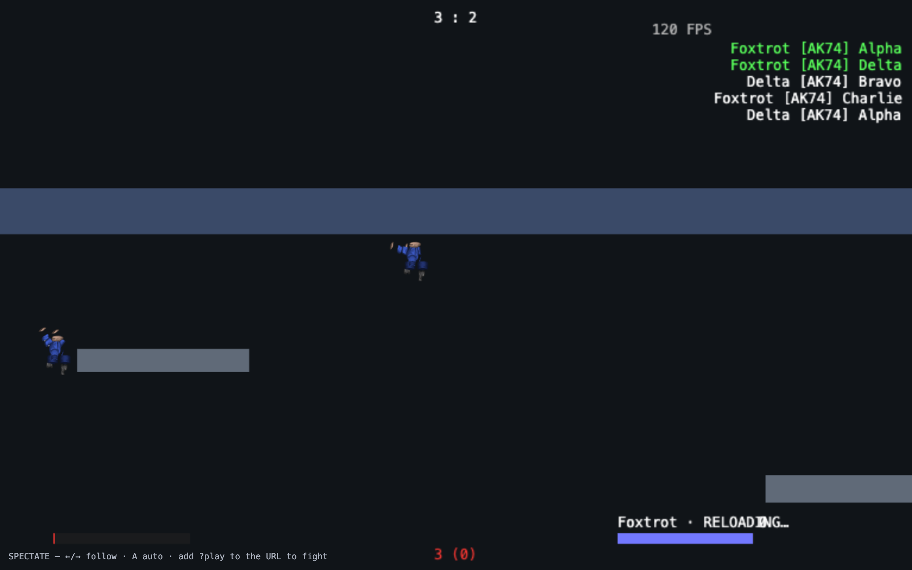

# Rewriting Soldat in TypeScript: a build diary

*June 2026*

In 2002, Michał Marcinkowski released Soldat — a 2D side-scrolling shooter with
ragdoll physics, jet boots, and a feel that nobody has quite replicated since.
The engine eventually went open source as OpenSoldat: about 65,000 lines of
FreePascal, a hand-rolled binary protocol, and twenty years of accumulated
load-bearing quirks.

This is the story of rewriting it for the web — TypeScript, PixiJS, WebAudio —
from the first archaeology pass to the build that greets you today: a bot-vs-bot
jetpack dogfight you can watch before you ever touch a key.

A note on the screenshots: every image in this post was captured *today*, live,
by checking out the historical commit in a git worktree, booting that exact
build under a dev server, and screenshotting it in headless Chrome over the
DevTools protocol. Nothing here is a mockup or a memory. The tooling for that is
part of the story too, so it's covered at the end.

## Part 1: Read the engine before you touch it

The first prompt of the project wasn't "write code." It was:

> we are going to modernize this game. start off by using a workflow to build an
> understanding of how it works and everything inside of it, logging all that to
> deciduous to keep track of how and why things are the way they are.

So before any TypeScript existed, thirteen parallel research agents each mapped
one subsystem of the Pascal engine — game loop, player physics, bullets,
map/collision, networking, AI, rendering, audio/input, server infra, scripting,
console/cvars, things/objects, build system — and a fourteenth synthesized the
whole-engine picture. All of it went into a decision graph (more on that later),
which means six months on I can still tell you exactly what we found:

- **Everything is a 1-indexed global fixed array.** `Sprite[1..32]`,
  `Bullet[1..254]`, `Thing[1..90]`. No allocation, no ownership — every
  subsystem reads and writes the same globals. Slot 0 doesn't exist; the wire
  protocol, the script API, and twenty years of community maps all assume
  1-based indices.
- **The feel lives in magic constants.** A fixed 60 Hz tick, gravity `0.06`,
  Verlet-style particle damping `0.98`, surface friction `0.970`. The soldier
  isn't a rigid body; it's a cloud of particles with constraints, and the
  movement "magic" is just these numbers interacting.
- **Determinism is structural.** Client prediction replays the same physics the
  server runs, so both sides must compute bit-identical results. In Pascal this
  falls out of everyone using the same `Single` (32-bit float) math.
- **Three compatibility contracts** matter to the community: the wire protocol,
  the `.PMS` binary map format (CRC32-stamped), and the PascalScript modding
  API.

That last list is really a list of decisions waiting to be made: which contracts
do you keep, and which do you break?

## Part 2: The four locked decisions

With the map of the engine in hand, we locked four choices and wrote them into
`docs/PORT-PLAN.md` so they'd stop being relitigated:

**1. TypeScript, strict, web-first.** PixiJS/WebGL2 for rendering, WebAudio for
sound, WebTransport planned for netcode. The reason is distribution: a game you
can send someone as a URL has a different gravity than a game you install.

**2. Clean-break protocol.** The original wire format is hand-packed records
with deliberate field scrambling (to annoy game hackers, per the comments) and
hard caps baked into the message layout. We versioned a new protobuf-based
schema instead. Old and new servers are separate populations — a real cost,
paid consciously.

**3. Faithful-first porting.** Port line-by-line from Pascal first; refactor
later. Every ported function carries a provenance comment — `// PORT:
shared/mechanics/Sprites.pas:1234` — so any TS behavior can be diffed against
its Pascal source. Where we *deliberately* diverge, the code says so loudly
with a `DESIGN OVERRIDE` marker and a pointer to the decision-graph node that
ratified it. Faithfulness is the default; deviation is documented.

**4. f64 production, f32 validation.** Here's the neat trick that fell out of
the clean break. Pascal computes in 32-bit `Single`; JavaScript numbers are
f64. Matching Pascal bit-for-bit in production would mean wrapping every
operation in `Math.fround` forever. But because *both* our client and our
server run the same TypeScript, they only need to match **each other** — and
identical code on identical inputs does that for free. Fidelity to the
*original Pascal feel* is a separate axis, so it became a *test* instead of a
runtime constraint: every physics operation goes through a scalar wrapper
`f()`, which is the identity function normally and `Math.fround` when the
`STRICT_F32` flag is set. The test suite runs twice, once in each mode, and a
golden-master harness replays scenarios against closed-form expectations.

That re-framing — "fidelity is a test gate, not a production property" — turned
the scariest research question of the rewrite into CI.

## Part 3: The milestone ladder

The port plan defined milestones M0 through M9: bootstrap, map rendering,
physics core + golden master, movement, combat, bots, netcode, game
modes/HUD/audio, modding, refactor. Then the build entered what I can only
describe as a loop. My prompts from that stretch, verbatim from the transcript:

> commit in logical chunks and lets get this party going in a workflow

> keep it all going in parallel and PR it but approve and workflow through
> yourself

> keep goiung in a loop im going to the knicks game

While I was at the Knicks game, parallel agent workflows ported subsystems with
explicit cross-package contracts agreed upfront (the constants module exports
`MAX_SPRITES`; the physics agent imports it; conflicts surface at typecheck,
not at 2 a.m.). Each cycle ended the same way: wire the barrels, `tsc --build`,
run the tests in f64, run them again under `STRICT_F32=1`, commit a logical
chunk, update the process docs and the decision graph, start the next
milestone. M0 through M8 landed with 269 tests green in both float modes.

The decision graph kept the review process honest, too. Interleaved with the
milestone outcomes are adversarial review nodes that didn't pull punches:
the RNG is mulberry32 and *not* Pascal-sequence-compatible, which caps what the
golden master can validate (node 55); the "sandboxed" ScriptHost wasn't
actually sandboxed yet (node 73); and the sharpest one — seven milestones
green, "zero ground-truth validation" (node 68). All typecheck and unit tests;
no human had seen a pixel.

That last review proved prophetic.

## Part 4: "nothing in the game works"

My entire bug report, after trying to run the client for the first time:

> nothing in the game works

Both bugs that surfaced were invisible to the type system and the unit tests,
and obvious the moment a real browser drew a frame:

1. **The map rendered black.** The custom GLSL shader had a `uColor` uniform
   that was never bound, so it defaulted to transparent black and multiplied
   every vertex color to nothing. Fix: throw away the custom shader and draw
   the map with PixiJS `Graphics`, which binds its own resources.
2. **The player fell through the floor.** The collision system pushes you out
   of a polygon along its normal — and the synthetic dev map had degenerate
   normals, so the push-out vector was `(0, 0)` and you sank straight through.
   Real `.PMS` maps store valid normals; our hand-built test scene didn't. Fix:
   a geometric fallback that derives edge perpendiculars from vertex positions
   when stored normals are junk.

Here is that exact build — the smoke-test commit, running live today. The
synthetic fallback scene's RGB triangles, the player a few pixels of vector art
(captured mid-jump; the screenshot rig holds W down), and the HUD already
wired:

The lesson got its own observation node: structural verification (types, tests,
CI) and ground-truth verification (pixels, playtests) are different categories,
and no amount of the first substitutes for the second. Every feature since has
ended with a headless-browser check.

A smaller bug from the same stretch deserves its tidbit status: **the baby
jump**. Jump force was applied for exactly one tick, so the soldier hopped like
the floor was hot. Real Soldat applies jump force across the several ticks of
the jump animation — hold to go higher, release to cut it short. Same story for
the jetpack, which had no fuel because nothing ever filled the tank. Impulses
that are actually *sustained forces with a window* are a classic porting trap.

## Part 5: Make it a game — the combat sandbox and the one gun

With movement believable, the next commit turned the tech demo into a game: an
arena generator, bots, shooting, death and respawn, and procedurally drawn
"Gostek" stick-soldiers (head, torso, limbs, a gun line — pure vector art).
This build, live today; red is the player (the rig is holding the mouse button
— note the tracers in flight), blue are bots:

Then came a decision that shaped everything after. Soldat ships ten primaries
and four secondaries; we ported the entire stat table (every weapon's
`hitMultiply`, fire interval, reload time, bullet speed — including the
delightful quirk that the COLT lives at array index 11 but its `Num` field is
0, an off-by-eleven the original maps depend on). And then we used exactly one
gun:

> one gun for now. im sticking with just one.

Everyone gets the AK-74. The whole combat sandbox balances around one weapon's
triangle of dynamics:

- **Spray control** — spread starts near-pinpoint (0.015 rad) and blooms by
  0.012 rad per sustained shot up to a 0.16 rad cap, decaying when you let off.
  Tap and you're accurate; hose and you're spraying.
- **Quick reactions** — ~10 shots/sec, 30-round magazine, fast-but-dodgeable
  projectiles. Time-to-kill is short but never instant.
- **Terrain cover** — bullets are blocked by geometry, and a 1.6-second reload
  forces you to break line of sight.

One gun means one balance surface. Every tuning question since — jump height,
aim assist, bot behavior — has been answerable against a fixed baseline instead
of a 14-weapon matrix.

## Part 6: Real assets, carefully

The original game's art — Gostek body-part textures, map textures, interface
graphics — exists and works, but its licensing isn't ours to launder, so the
repository takes a position: *code is committed, assets are not*. A
`fetch-assets.sh` script and a README explain how to supply your own; the
`.gitignore` is deliberately broad; and every rendering path has a vector
fallback so the game stays playable with zero assets present.

With assets supplied, the flat-color world snaps into the real thing. This is
the real-assets commit running `ctf_Ash` today — textured polygons, textured
soldiers, the player mid-reload:

The texturing pipeline had its own archaeology: `.PMS` maps store per-vertex
UVs against a named texture file, edge-stretched scenery, and a sector grid for
collision lookup. The loader honors CRC32 hashes and survives maps with invalid
normals (see Part 4) because community maps contain *everything*.

## Part 7: Keyboard-only aim, and an assist that never lies to you

Here's a design decision I didn't expect to care about: the game is fully
playable without a mouse.

> WASD move, IJKL aim, Space fire, Tab reload, Shift jet.

IJKL aiming is a little state machine with *persistent angle*: each tap nudges
your aim a few degrees, holding swings it fast, releasing freezes it where you
left it. Keys combine for diagonals; a horizontal tap does a turnaround without
dumping your elevation. The startup controls screen renders from
`CONTROL_BINDINGS` — the same table the input tests pin — so the help screen
cannot drift from reality. (It also currently shows on *every* startup, an
explicit "the scheme is in flux" choice.)

The bug this scheme surfaced is my favorite input bug of the project: **the
first-mousemove takeover**. Aim follows the mouse if you use the mouse — but
the *very first* mouse event of a session, even an accidental 3-pixel nudge
while reaching for the keyboard, would snap your carefully-set keyboard aim to
wherever the cursor happened to sit. The fix treats the first mouse sample as
baseline-only: it establishes where the mouse *is*, and only subsequent
*movement* takes aim over. Verified the keyboard-only path works with a
headless playtest that fired the rifle with zero mouse events ever dispatched —
the ammo counter draining 30 → 21 was the proof.

Keyboard aim is coarse, though, so the game grew **light aim assist** — with
two hard design lines drawn after considering and rejecting crosshair
magnetism:

1. The crosshair never moves. The *shot* bends, at fire time, by at most 2.9°,
   and only when you're already aiming within ~9° of a live enemy inside 700px.
   Assist rewards near-correct aim; it never takes over.
2. Spread applies *after* the bend, so spray bloom still punishes held fire.
   The assist can't out-shoot the recoil model.

And one rule that will matter in a moment: **bots never get the assist**. An
assisted bot is just an aimbot.

## Part 8: Rocket boots — tuning the sim, on purpose

Soldat's jets were always more hover than rocket. This game went the other way:

- thrust is vertical-favoring (1.8× up-force, lateral drift damped to half
  while jetting),
- the tank is big — 700 ticks ≈ 11.7 s of continuous burn,
- and fuel regenerates fast on the ground (~4 s empty-to-full), so jets gate
  *engagements* without ever gating *movement*.

The interesting part is *where* that tuning lives. Two options were logged: 
tune inside the sim core (and accept that bots and player both inherit it), or
override at the client layer and keep the sim faithful. The decision went to
the sim core *with explicit DESIGN OVERRIDE markers* — the faithful-first rule
bends, but it has to say so in the code, next to the Pascal line numbers it's
overriding.

The bug from this era: **force clobbering**. Jump wrote its impulse to
`force.y`; the jetpack's ground-kick wrote *its* (smaller) impulse to the same
field a few lines later. Press jump+jet together — the most natural input in
the game — and you took off *weaker* than jump alone. The fix is one rule:
most-upward-force wins. Side-jumps also kept only 90% of their vertical so
obstacle-clearing stayed possible mid-strafe.

## Part 9: Spectate mode, and the bots that secretly couldn't shoot

To judge the gameplay honestly we needed to *watch* it without playing it. So:
spectate mode — a bot-vs-bot match with no human soldier, an action camera, a
kill feed, and a scoreboard.

Two pieces of design got real decision-graph deliberation:

**Kill attribution.** A bullet that kills you *dies on the same tick*, so a
pure-client scan after the physics step loses the linkage. The hybrid that won:
the sim records `lastHitBy` on every damaging hit (last hit wins), and the
client fires its `onKill` hook exactly once, at the death edge it already
detects for respawn timers.

**The camera is a broadcast director, not a free-cam.** Every bot gets an
interest score — a recent kill dominates (decaying over ~5 s), then active
firing, then proximity to the nearest enemy. The camera holds a subject for a
minimum 3.5 s dwell, switches only when a challenger clears a hysteresis
margin, cuts (rather than pans) on cross-map switches, and when your subject
dies it cuts to the killer. Watching it feels like someone is *operating* it,
which is the whole trick.

And then the bug that justified the entire feature. The first bot-vs-bot match
was a pacifist standoff: **no bot ever fired a single shot.** The ported
perception code faithfully skips invisible sprites — `alpha !== 255` — exactly
as the Pascal does. But nothing in our spawn path ever *set* alpha, and the
default was 0. Every bot was, by its own rules, invisible to every other bot.
They had been fighting only the player all along, who — being human — never
noticed that nobody else got shot at. One line (`s.alpha = 255` at spawn)
turned the lights on.

Here's the spectate-mode commit running today on `ctf_Ash`, six bots, kill feed
flowing, the director parked on Foxtrot:

With the match running headless we could finally *measure* the game. First
judgment of a 3.7-minute match: 16.3 kills/min (hot), median 3.1 s between
deaths, 100% kill attribution, camera on the action 55% of the time — and one
glaring number: jet usage was **1.7–3.8% of alive time**. We'd built rocket
boots and a vertical game, and the bots fought like infantry.

## Part 10: Telemetry, then Skyreach — making the sky the map

Eyeballing matches doesn't scale, so the next commit added a versioned match
telemetry schema: every shot, hit, kill, and a 2 Hz position/fuel sample for
every bot, dumpable from the browser (`window.__match.dump()`) and analyzable
by a script. The numbers sharpened the diagnosis: ~21% hit rate, 81px median
kill distance, 2–4% jet use. Close-range floor brawls, wall to wall.

The fix came in layers, all logged under one goal ("Default = spectate bot
match in a big aerial level, jetpack-combat focused"):

- **Skyreach**, a purpose-built aerial arena: a thin ground floor that's a
  fallback net rather than a battlefield, tall walls, and tiers of small
  floating pads — perches, not floors — so getting anywhere means flying.
- **Aerial bot AI**: the faithful Pascal gate (only jet when the target is a
  full 180px overhead) is precisely why bots fought on the floor, so a DESIGN
  OVERRIDE chases *any* height advantage, and bots roll multi-tick jet
  *bursts* (0.4–0.75 s holds) during close engagements instead of 1-tick taps
  that barely lift them.
- **Air fuel trickle**: coasting in the air regenerates 1 fuel/tick — exactly
  the burn rate — so a 50% thrust duty cycle hovers forever, but climbing
  still spends the tank.
- **Spectate is the default.** Open the game and you're watching the dogfight;
  `?play` opts you into fighting.

Result, by the same telemetry: jet use went from 2–4% to **47–56%** of alive
time, median kill distance doubled. Then a playtest note — "corner pogo…
height runaway… these pad heights are way too uniform" — produced Skyreach v2:
a ceiling slab to contain the infinite-climb the air trickle had enabled (mean
altitude was running away to −361 before the lid; contained to a stable
−140…−226 band after), and an irregular, asymmetric pad layout with 15
distinct heights. 391 tests green.

This is what greets you on startup today:

And zoomed in mid-fight — two bots airborne, one reloading on the wing
(the wheel-zoom is dispatched over CDP, so even the close-up is the real
running game):

## Part 11: How this was actually built — the meta-machinery

Some of the most interesting engineering in this project isn't in the game.

**The decision graph.** Every goal, option, decision, action, and outcome lives
in a queryable graph (140 nodes as I write this), with edges enforcing a flow:
goals lead to options, options to a decision, decisions to actions, actions to
outcomes. Root goals store my *verbatim* prompts — not summaries — because
"what was actually asked" is the context that makes a decision recoverable six
months later. A pre-commit-style hook even blocks file edits unless a graph
node was logged in the last 15 minutes, which sounds draconian and works: the
graph can't drift from the work, because the work can't happen without the
graph.

**Reviews as first-class nodes.** The adversarial review findings — the RNG
fidelity cap, the unsandboxed sandbox, the verification-depth warning — sit in
the same graph as the milestones they criticize, linked to them. The project's
self-criticism has provenance.

**The screenshot rig that illustrated this post.** Headless Chrome's one-shot
`--screenshot --virtual-time-budget` mode captures this app as a black frame —
virtual time expires before PixiJS finishes its async boot. So the rig drives
real Chrome over the DevTools protocol instead: launch with a throwaway
profile, open the page, wait *real* seconds while the match actually develops,
then capture. It can hold keys down (that's how the first-light player is
mid-jump and the sandbox player is firing — historical builds predate hostile
bots, so the player provides the action), hold the mouse button for
pre-keyboard-era builds, and dispatch wheel events for zoomed close-ups. The
historical builds themselves ran from git worktrees: check out the old commit,
copy the untracked assets in, `pnpm install` (the oldest one predates the
repo's pnpm version pin — a problem whose fix is itself a later commit), and
serve four eras of the game side by side on four ports.

**Honest ledger, same graph.** What's still open is logged next to what's done:
the FreePascal golden-master cross-check (the final feel-fidelity gate) remains
human-gated; the RNG will need a faithful Pascal port before combat scenarios
can join the golden master; the skeleton/ragdoll, grenades, weapon switching,
and netcode transport are still ahead. And the next chapter is already in
flight: swappable bot-AI engines behind an adapter, with a side-by-side duel
viewer to watch two brains fight it out.

## Closing

Twenty-year-old games survive on feel, and feel doesn't live in any single
function — it lives in `0.06` gravity interacting with `0.98` damping at
exactly 60 Hz, in a jump that's a window and not an impulse, in jets that gate
fights but never strand you. The rewrite's bet is that you can move all of that
across a language boundary if you do three things relentlessly: read before you
write, make fidelity a test instead of a vibe, and write down *why* — every
choice, every reversal, every bug that turned out to be a one-line lights-on.

The game opens on six bots dogfighting over Skyreach. Add `?play` to the URL
and go beat them. They won't get aim assist. You will.

---

*All screenshots captured live from the running game on June 9, 2026 — four of
them from historical commits resurrected in git worktrees for this post. The
screenshot tool is `soldat-ts/tools/screenshot.mjs`.*
